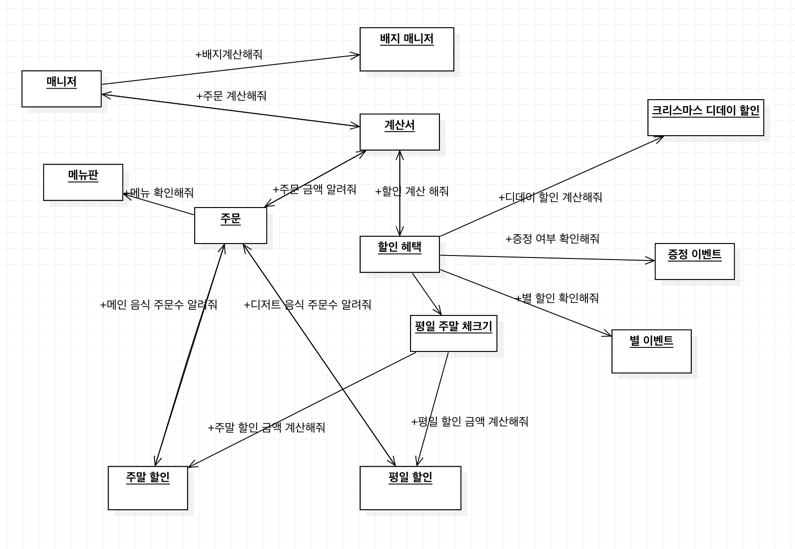

## 기능 목록

---

### 메인 기능
- [X] 총 할인 금액 계산하기 (총 금액 10,000원 이상 부터 적용)
    - [X]  (1~25일) 1000원 부터 시작하여 100원씩 추가 할인
    - [X]  해당 날짜가 평일인지 주말인지 확인
    - [X]  평일(일요일~목요일)에는 디저트 메뉴 -2023* 수량 원
    - [X]  주말(금요일, 토요일)에는 메인 메뉴 -2023* 수량 원
    - [X]  이벤트 달력에 별이 있는 날은 총주문 금액에서 1,000원 할인
    - [X]  할인 전 총주문 금액이 12만 원 이상일 때  샴페인 1개 증정
---
- [X] 총 주문 금액 계산하기 (할인 전)
- [X] 주문 내역 저장하기
- [X] 총 헤택 금액에 따른 12월 이벤트 배지 부여하기
  - [X] 5000원 이상 : 별
  - [X] 1만원 이상 : 트리
  - [X] 2만원 이상 : 산타
- [X] 방문 날짜 입력
  - [X] 1~31 숫자만 가능 (아닌경우 에러메시지 후 다시 입력 받기)
- [X] 메뉴 주문 하기 [예외시 에러메시지후 다시 입력 받기]
  - [X] 음료만 주문 불가
  - [X] 메뉴는 한번에 최대 20개까지 주문 가능
  - [X] 메뉴판에 없는 메뉴 주문불가
  - [X] 메뉴의 개수는 1이상의 수만 입력 가능
  - [X] 중복 메뉴 주문 불가
- [X] 혜택 주문서 출력 하기
  - [X] 주문 메뉴 리스트 출력하기 (출력 순서 자유)
  - [X] 할인 전 총주문 금액 출력하기 ()
  - [X] 증정 메뉴 출력하기
    - [X] 증정 메뉴 없을 때 : 없음
  - [X] 혜택 내역 출력하기 (출력 순서 자유)
    - [X] 적용된 혜택 내역만 출력하기 
    - [X] 혜택 내역 없을 때 : 없음
    - [X] 혜택 내역 있을 때 : [혜택이름: -0,000원]
  - [X] 총 혜택 금액 출력하기 (증정메뉴 금액 포함)
    - [X] 혜택 금액 0원일 때 : 0원
    - [X] 혜택 금액이 있을 때 : -00,000원
  - [X] 할인 후 예상 결제 금액 출력하기 (할인 전 총주문 금액 - 할인 금액)
  - [X] 12월 이벤트 배지 출력하기
    - [X] 배지가 없을 때 : 없음
  

## 초반 설계

---

- 행동을 기반으로 객체를 식별하고 상호작용하도록 구성하였습니다.